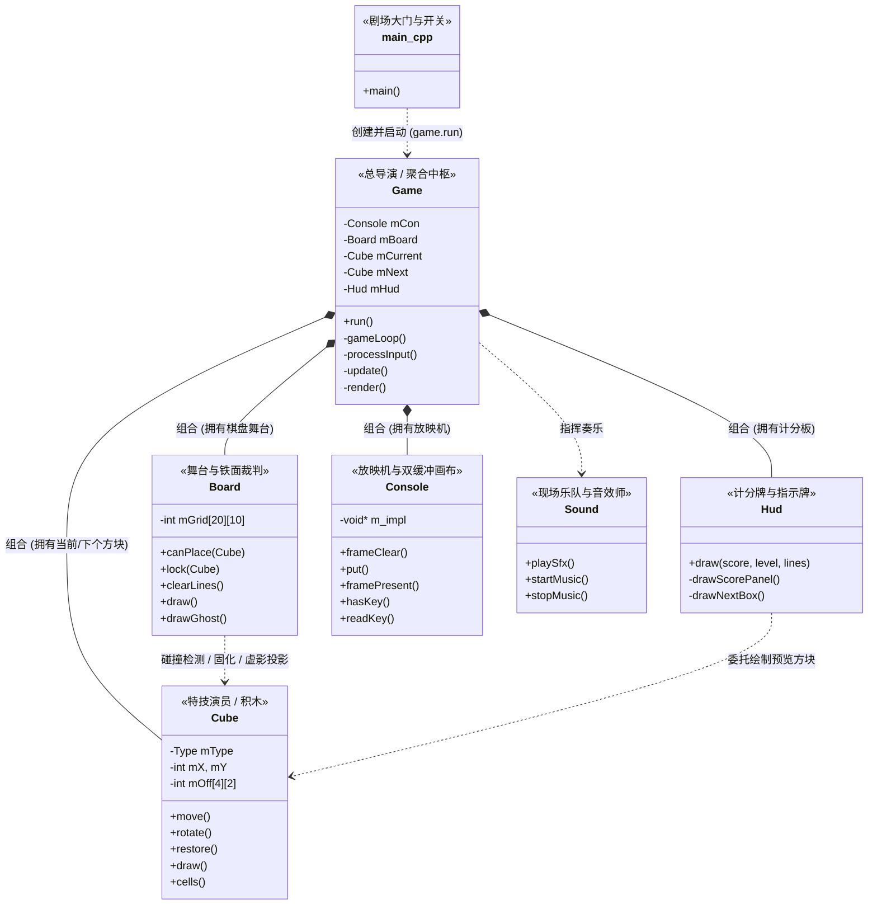
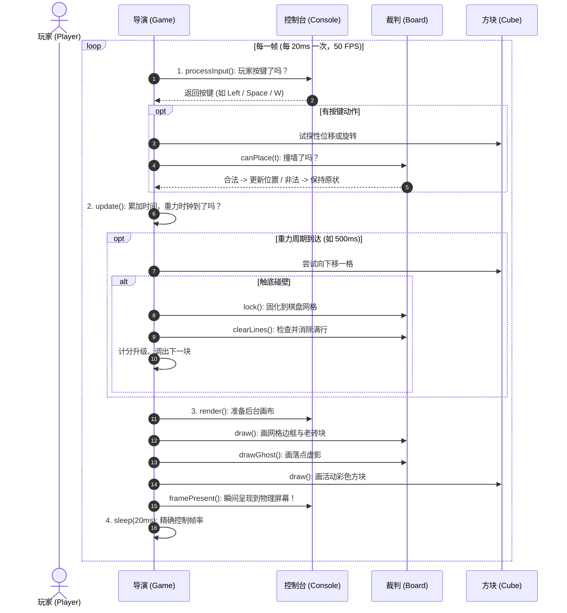

# 🎮 给儿子的 C++ 面向对象实战宝典 —— 从俄罗斯方块看 OOP 的精妙设计

> **写在前面**：  
> 编程不仅仅是写下一行行指令，更像是用代码构建一个井然有序的微型虚拟世界。  
> 很多初学 C++ 的同学最先接触的是 `if`、`for` 循环和函数，容易把所有逻辑一股脑写进一个长长的 `main()` 里。  
> 这本指南将带你走进 **面向对象编程 (Object-Oriented Programming, OOP)** 的大门，以你眼前的这款经典 **俄罗斯方块 (Tetris)** 游戏为例，带你领略优秀的架构设计是多么优雅与有趣！

---

## 目录
- [一、舞台剧比喻：初识面向对象的整体架构](#一舞台剧比喻初识面向对象的整体架构)
- [二、游戏工业界的心跳：经典游戏主循环 (Game Loop)](#二游戏工业界的心跳经典游戏主循环-game-loop)
- [三、面向对象的核心原则在游戏中的体现](#三面向对象的核心原则在游戏中的体现)
  - [1. 封装 (Encapsulation) 与 数据隐藏](#1-封装-encapsulation-与-数据隐藏)
  - [2. 单一职责 (Single Responsibility Principle) 与 信息专家](#2-单一职责-single-responsibility-principle-与-信息专家)
  - [3. 组合优于继承 (Favor Composition over Inheritance)](#3-组合优于继承-favor-composition-over-inheritance)
- [四、俄罗斯方块的硬核数学与物理算法图解](#四俄罗斯方块的硬核数学与物理算法图解)
  - [1. 屏幕坐标系与“正方形”的秘密](#1-屏幕坐标系与正方形的秘密)
  - [2. 7 种方块的相对坐标与顺时针旋转推导](#2-7-种方块的相对坐标与顺时针旋转推导)
  - [3. 试探性更新机制 (Trial Move)](#3-试探性更新机制-trial-move)
  - [4. 消行算法与为什么有 `y++`](#4-消行算法与为什么有-y)
  - [5. 落点虚影 (Ghost Piece) 物理投影](#5-落点虚影-ghost-piece-物理投影)
- [五、C++ 新手必修关键语法速查](#五c-新手必修关键语法速查)

---

## 一、舞台剧比喻：初识面向对象的整体架构

如果把这个俄罗斯方块游戏比作**一出精彩的剧场舞台剧**，你会发现每个 C++ 类都扮演着一位不可或缺的专业人员：



### 角色对应清单：

| 类名 | 现实角色比喻 | 核心职责 | 对应文件 |
| :--- | :--- | :--- | :--- |
| **`main`** | **剧场总开关** | 入口极简，只负责实例化 `Game` 并调用 `game.run()` | [main.cpp](file:///d:/Code/rucube/main.cpp) |
| [Game](file:///d:/Code/rucube/Game.h) | **总导演 (Mediator)** | 掌控节奏，驱动每一帧的输入、物理更新、渲染，管理分数与关卡状态 | [Game.h](file:///d:/Code/rucube/Game.h) / [Game.cpp](file:///d:/Code/rucube/Game.cpp) |
| [Cube](file:///d:/Code/rucube/Cube.h) | **特技演员 (Actor)** | 7 种经典俄罗斯方块积木。只管自己的形状、坐标、翻滚与绘制，不管撞墙 | [Cube.h](file:///d:/Code/rucube/Cube.h) / [Cube.cpp](file:///d:/Code/rucube/Cube.cpp) |
| [Board](file:///d:/Code/rucube/Board.h) | **舞台与裁判 (Referee)** | 维护 10×20 棋盘网格；判断方块是否撞墙；消除满行；计算落地虚影 | [Board.h](file:///d:/Code/rucube/Board.h) / [Board.cpp](file:///d:/Code/rucube/Board.cpp) |
| [Hud](file:///d:/Code/rucube/Hud.h) | **仪表盘与计分牌 (View)** | 负责排版展示得分、等级、消行数、操作指引与右侧 Next 预览框 | [Hud.h](file:///d:/Code/rucube/Hud.h) / [Hud.cpp](file:///d:/Code/rucube/Hud.cpp) |
| [Console](file:///d:/Code/rucube/Console.h) | **荧幕放映机 (HAL)** | 封装底层复杂的 Windows 终端 API，提供双缓冲防闪烁画面与非阻塞键盘输入 | [Console.h](file:///d:/Code/rucube/Console.h) / [Console.cpp](file:///d:/Code/rucube/Console.cpp) |
| [Sound](file:///d:/Code/rucube/Sound.h) | **现场乐队 (Audio)** | 后台独立线程播放 8-bit 复古电子背景音乐与清脆的方块撞击/消除音效 | [Sound.h](file:///d:/Code/rucube/Sound.h) / [Sound.cpp](file:///d:/Code/rucube/Sound.cpp) |
| [GameConfig](file:///d:/Code/rucube/GameConfig.h) | **全局图纸 (Config)** | 统一管理屏幕尺寸、格子比例、边框位置等全局常量，杜绝魔法数字 | [GameConfig.h](file:///d:/Code/rucube/GameConfig.h) |

---

## 二、游戏工业界的心跳：经典游戏主循环 (Game Loop)

无论是《俄罗斯方块》，还是你平时玩的《原神》、《我的世界》或 3A 大作，底层都有一个**心跳泵**，那就是 **Game Loop（游戏主循环）**。

在 [Game.cpp](file:///d:/Code/rucube/Game.cpp#L259-L277) 中，每一帧（20 毫秒，即 1 秒 50 帧）都在循环执行以下 4 个标准动作：



---

## 三、面向对象的核心原则在游戏中的体现

### 1. 封装 (Encapsulation) 与 数据隐藏

**什么是封装？**  
把数据（成员变量）保护起来，放在 `private:` 区域；只通过公开的函数（`public:` 方法）与外界沟通。

* **生动比喻**：就像你家的微波炉，厂家把高压电容、磁控管都封装在铁皮外壳里（`private`），只给你留出几个按钮（`public: heat(), stop()`）。如果你能随便用手触碰里面的高压电线，机器瞬间就会短路爆炸！
* **代码体现**：
  在 [Cube.h](file:///d:/Code/rucube/Cube.h) 中：
  ```cpp
  class Cube {
  public:
      void move(int dx, int dy);   // 对外公开的行为
      int  x() const { return mX; } // 只读查询
  private:
      int  mX, mY;                 // 严加保护的私有坐标！
  };
  ```
  外部代码**绝不能**直接写 `cube.mX = 999;`。因为如果允许外部随意篡改 `mX`，谁来做越界检查？方块就会直接飞出屏幕导致程序崩溃！

---

### 2. 单一职责 (Single Responsibility Principle) 与 信息专家

**面向对象好习惯：让每个类只专注做好一件事！**

很多初学者容易犯的错误：把碰撞检测写在方块里面，比如 `Cube::checkCollision()`。  
但你想想：一个方块怎么会知道自己左边有一堵墙？它怎么知道底下已经堆了 5 层老砖块？  
如果方块要知道这些，它就必须把整个棋盘的数据都存一份，这就让代码变得又臃肿又混乱！

* **信息专家原则 (Information Expert)**：**谁掌握完整的数据，事情就该由谁来做！**
* 棋盘 [Board](file:///d:/Code/rucube/Board.h) 拥有整个 10×20 网格的所有数据。所以，裁判权在 [Board::canPlace()](file:///d:/Code/rucube/Board.cpp#L17-L28)：
  ```cpp
  // 裁判说行才行，裁判说不行就不行！
  bool Board::canPlace(const Cube& c) const;
  ```

---

### 3. 组合优于继承 (Favor Composition over Inheritance)

初学者往往以为面向对象就是狂写 `class Dog : public Animal`（继承）。  
但在实际的大型工程中，**组合（Composition / HAS-A 关系）** 远比继承更常用、更强大！

* **HAS-A 关系**：
  * [Game](file:///d:/Code/rucube/Game.h) **拥有**一个棋盘（`Board mBoard`）；
  * [Game](file:///d:/Code/rucube/Game.h) **拥有**一个当前方块（`Cube mCurrent`）；
  * [Game](file:///d:/Code/rucube/Game.h) **拥有**一个控制台显示屏（`Console mCon`）。
* 每个零件独立测试、随时可以插拔或升级，整个架构稳固如磐石！

---

## 四、俄罗斯方块的硬核数学与物理算法图解

### 1. 屏幕坐标系与“正方形”的秘密

在计算机控制台中，坐标系长这样：
```text
(0,0) ─────── X 轴向右递增 ───────>
  │
  │
  Y 轴向下递增
  │
  v
```
**为什么每个格子横向要占 2 个字符（`CELL_W = 2`）？**  
在控制台字体中，英文字符的宽度只有高度的一半（宽高比约 1:2）。  
如果你只画 1 个字符（例如 `[]`），方块看起来就是个扁扁的长方形；  
所以我们用 2 个字符拼成一格（比如两个字符宽度的 `[]`），视觉上就变成了完美的**正方形**！

---

### 2. 7 种方块的相对坐标与顺时针旋转推导

在 [Cube.cpp](file:///d:/Code/rucube/Cube.cpp#L7-L22) 中，每个方块由 4 个小格子相对于锚点 `(mX, mY)` 的局部偏移构成：

```text
以 T 型方块为例：
偏移坐标：{0,1}, {1,1}, {2,1}, {1,0}

        dx=0    dx=1    dx=2
dy=0           [  ]          <-- {1, 0}
dy=1   [  ]    [  ]    [  ]  <-- {0, 1}, {1, 1}, {2, 1}
```

#### 顺时针旋转 90 度的数学变换：
在屏幕坐标系中（Y 朝下），一个点 `(dx, dy)` 顺时针旋转 90° 的数学公式是：
$$\text{new\_x} = \text{old\_dy}$$
$$\text{new\_y} = -\text{old\_dx}$$

旋转之后，某些格子的坐标可能会变成负数（跑到锚点左边或上边）。  
我们在 [Cube::rotate()](file:///d:/Code/rucube/Cube.cpp#L61-L75) 中做了一个非常漂亮的**重对齐操作**：
1. 找出旋转后所有格子中最小的 `minX` 和 `minY`；
2. 所有格子整体减去 `minX` 和 `minY`；
3. 方块就被重新拉回到了包围盒的左上角 `(0, 0)`！对所有 7 种方块完美通用！

---

### 3. 试探性更新机制 (Trial Move)

玩家按下了左方向键，方块会不会撞墙？  
我们不用复杂的如果-否则分支去预判，而是采用**试探性替身模式**：

```cpp
// 1. 复制一份替身副本
Cube t = mCurrent;

// 2. 让替身尝试往左挪一步
t.move(-1, 0);

// 3. 请裁判 Board 来检查替身的位置是否合法
if (mBoard.canPlace(t)) {
    mCurrent = t; // 合法！才真正接受这次移动！
}
// 如果不合法，什么都不做，替身 t 出了作用域自动销毁，原方块丝毫不受影响！
```
这种设计让移动、下落、旋转完全不用担心穿墙穿模！

---

### 4. 消行算法与为什么有 `y++`

在 [Board::clearLines()](file:///d:/Code/rucube/Board.cpp#L50-L80) 中：
```text
从最底部 y = 19 往上检查：
Row 19: 满行！ -> 上面所有的行整体向下落一行（覆盖掉第 19 行）
现在原本的第 18 行掉落成了新的第 19 行！
★ 关键操作：执行 y++！
为什么？因为外层 for 循环末尾会自动执行 y--。
如果我们不 y++，下一步就会去检查 y = 18；
但刚掉下来的这行还没检查过呢！万一它也是满行就会被漏掉！
通过 y++ 与 y-- 相互抵消，循环会再次复查当前这一行！
```

---

### 5. 落点虚影 (Ghost Piece) 物理投影

现在的现代化俄罗斯方块都有一个超酷的特性：屏幕下方有一道淡淡的虚线轮廓，实时显示方块落下去的位置。  
实现它只需要 5 行代码（见 [Board::ghost()](file:///d:/Code/rucube/Board.cpp#L88-L96)）：
```cpp
Cube Board::ghost(const Cube& c) const {
    Cube g = c;                   // 1. 制造一个虚拟替身
    while (canPlace(g)) g.move(0, 1); // 2. 模拟重力一路往下坠，直到碰到底板
    g.move(0, -1);                // 3. 碰壁后回退一格（这就是着陆点！）
    return g;                     // 4. 返回这个投影替身画出来！
}
```

---

## 五、C++ 新手必修关键语法速查

为了让你在看代码时不被语法绊倒，这里把项目中用到的现代化 C++ 核心语法整理成了小卡片：

### 1. 为什么有 `.h` 和 `.cpp` 两个文件？
* **`.h`（头文件）**：相当于**餐厅菜单**，告诉所有人这个类有什么功能、提供什么函数，不包含具体烹饪细节；
* **`.cpp`（源文件）**：相当于**厨房后厨**，真正编写每一道菜的烹饪步骤（函数的具体实现）。

### 2. 什么是 `const Cube& c`（常量引用传递）？
* 传值 `Cube c`：每次进函数都把整个对象完整复印一份，浪费 CPU 和内存；
* 传引用 `Cube& c`：直接把原对象递给函数，速度极快（零拷贝），但有被偷偷改坏的风险；
* 常量引用 `const Cube& c`：**“只许看不许改”的零拷贝传递**！C++ 工程中的黄金标准！

### 3. 构造函数初始化列表 (Initializer List)
```cpp
// 推荐做法（直接初始化，效率最高）：
Cube::Cube(Type t) : mType(t), mX(SPAWN_X), mY(SPAWN_Y) { }

// 不推荐做法（先默认初始化再赋值，多了一道工序）：
Cube::Cube(Type t) {
    mType = t;
    mX = SPAWN_X;
}
```

### 4. 范围 for 循环 (Range-based for loop)
```cpp
// 现代 C++ 风格：像英语一样自然流畅！
for (const auto& cell : c.cells()) {
    std::cout << cell.x << ", " << cell.y << "\n";
}
```

### 5. 什么是双缓冲 (Double Buffering)？
* **普通输出**：在白板上一笔一笔画，观众看着你画，眼睛会看到闪烁和残影；
* **双缓冲**：你在后台暗室画好整张画，画完之后“啪”一下瞬间推到前台展示，丝滑流畅，彻底告别闪烁！

---

## 🎯 爸爸送给你的编程进阶小挑战

当你读懂了这份代码后，可以尝试亲自动手修改一两个小功能练练手：
1. **加分特效**：当消除 4 行（Tetris）时，试着在屏幕中间弹出一行金色的 `"★ TETRIS! ★"` 鼓励文字！
2. **新方块登场**：尝试在 [Cube.h](file:///d:/Code/rucube/Cube.h) 里设计一种全新的第 8 种方块（比如单点方块、十字星方块）！
3. **高分记录**：尝试利用 C++ 的 `<fstream>` 文件读写，在游戏结束时把最高分保存到本地 `highscore.txt` 文件中！

祝你探索 C++ 世界旅途愉快，写出属于你自己的第一个伟大游戏！🚀
