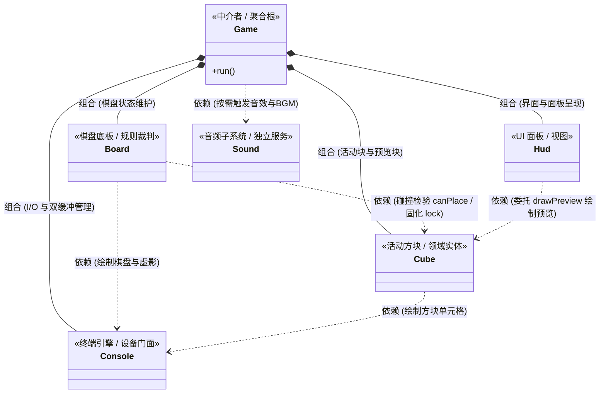

# 🎮 Tetris (rucube) — 控制台复古俄罗斯方块

[](https://en.wikipedia.org/wiki/C%2B%2B20)
[](https://www.microsoft.com/windows)
[]()
[]()

基于 **C++20** 与 **Windows Console API** 打造的沉浸式复古风格俄罗斯方块（Tetris）终端游戏。内置双缓冲无闪烁渲染、7 种经典方块逻辑、落点虚影预测（Ghost Piece）、阶梯递增重力加速，以及由算法纯程化合成的 8-bit 复古背景音乐与异步蜂鸣器音效。

---

## ✨ 核心特性

- 🖥️ **双缓冲无闪烁控制台渲染**
  - 基于 Windows `CHAR_INFO` 与 `WriteConsoleOutput` 实现双缓冲帧渲染，彻底告别画面撕裂与闪烁。
  - 针对控制台字符约 `1:2` 的高宽比进行适配，每个格子占用 2 个字符宽度，还原标准正方形方块视觉体验。
  - 自动分配并初始化独立控制台窗口，锁定最佳显示尺寸（80 × 30）。
- 🧱 **经典俄罗斯方块物理与规则**
  - **7 种经典 Tetromino**：包含 `I`、`O`、`T`、`S`、`Z`、`J`、`L`，每种方块赋予明快的专属配色。
  - **落点虚影（Ghost Piece）**：实时计算并在底板精准投影方块着陆虚线轮廓，提升落块判断力与操作爽感。
  - **Next 预览框**：右侧独立显示下一个即将登场的方块并在框内居中呈现。
  - **硬降（Hard Drop）与软降（Soft Drop）**：支持空格键一键触底瞬时锁定并获取双倍下落加分。
- 📈 **平滑重力递增与阶梯计分**
  - 重力以“格/秒”线性增长，规避传统线性减少延迟毫秒导致的后期速度断崖暴增；初始 2 格/秒，最高可至 8 格/秒（125ms/格）。
  - 每消除 10 行自动晋升等级，同时触发速度升级提示音。
  - 支持经典多行消行计分（1行/2行/3行/4行分别对应 100/300/500/800 × 等级倍率加成）。
- 🎵 **8-bit 程序化合成音乐与多线程音效**
  - **Chiptune BGM**：无须依赖任何外部 `.wav` / `.mp3` 资源文件，代码动态生成方波 PCM 音频并通过 `PlaySound` 在内存中循环混音播放。
  - **异步蜂鸣音效**：独立工作线程驱动，针对旋转、落地、消行（1~4行专属梯级音阶、Tetris 琶音爆发）、升级、开局与游戏结束提供即时音效反馈，不阻塞主游戏循环。
- 🕹️ **完整生命周期与交互体验**
  - 支持快捷暂停（P 键）与优雅退出（Q 键）。
  - Game Over 死亡红字闪烁动效，并提供单局结算再来一局（Y/N）循环。

---

## 🎮 操作指南

| 按键 | 功能 | 说明 |
| :--- | :--- | :--- |
| `A` 或 `←` (左方向键) | **向左移动** | 每次左移 1 格 |
| `D` 或 `→` (右方向键) | **向右移动** | 每次右移 1 格 |
| `W` / `↑` / `J` | **旋转方块** | 顺时针旋转 90°（O 型方块保持不变，遇阻防穿模） |
| `S` 或 `↓` (下方向键) | **软降 (Soft Drop)** | 加速下落，每下落一格奖励 +1 分 |
| `Space` (空格键) | **硬降 (Hard Drop)** | 瞬间穿梭到底部并直接锁定，每格奖励 +2 分 |
| `P` | **暂停 / 继续** | 暂停当前游戏并挂起重力计时 |
| `Q` 或 `Esc` | **退出游戏** | 退出游戏主循环 |
| `Y` / `N` | **再来一局** | 游戏结束（Game Over）时确认是否重新开始 |

---

## 📊 计分与难度规则

### 1. 消行得分计算
得分受当前关卡等级（Level）加权放大：

$$\text{Score} = \text{BaseScore}(\text{Lines}) \times \text{Level}$$

| 单次消行数 | 基础分 (BaseScore) | 专属音效 |
| :---: | :---: | :--- |
| 1 行 | 100 | 单行消除短音 |
| 2 行 | 300 | 双行连续音 |
| 3 行 | 500 | 三重上升音 |
| 4 行 (Tetris!) | 800 | 快速上行琶音 + 高音爆发 🎉 |

### 2. 速度与等级公式
- **当前等级**：$\text{Level} = 1 + \lfloor \frac{\text{Lines}}{10} \rfloor$
- **下落速度**：初始为 $2.0\text{ 格/秒}$，每升一级 $+0.4\text{ 格/秒}$，最高封顶 $8.0\text{ 格/秒}$（对应刷新间隔为 $125\text{ ms}$）。

---

## 🏗️ 架构设计

项目采用纯面向对象与高内聚低耦合的设计思想，清晰拆分渲染呈现、游戏逻辑、数据模型与音频驱动四大子系统。

### 1. 代码目录结构

```
rucube/
├── main.cpp         # 程序入口，负责 Game 实例化与生命周期驱动
├── Game.h / .cpp    # 游戏核心中枢：管理状态机、重力时钟、输入派发与主循环
├── Board.h / .cpp   # 棋盘网格（10x20）：碰撞检测、行消除判定、锁定与落点虚影计算
├── Cube.h / .cpp    # 方块模型：7 种 Tetromino 数据、坐标变换、包围盒与自绘制
├── Hud.h / .cpp     # 界面面板：得分榜、等级/行数、操作指引与 Next 预览框
├── Console.h / .cpp # 平台层渲染：封装 Windows 终端双缓冲、字体调色板与非阻塞键盘事件
├── Sound.h / .cpp   # 音频子系统：程序化合成 8-bit BGM 波形与多线程蜂鸣器音效
├── GameConfig.h     # 全局常量配置：控制台屏幕尺寸、棋盘锚点坐标与单元格比例
└── CMakeLists.txt   # CMake 工程构建脚本
```

---

### 2. 类关系图 (面向对象视角)



---

### 3. 面向对象的类关系与设计

从面向对象（OOP）视角，系统严格遵循**单一职责**与**低耦合高内聚**原则，将状态、规则、展示与设备驱动清晰解耦：

- **组合与聚合根（Composition & Aggregate Root）**
  - **`Game`** 作为全局**中介者与聚合根**，通过**强组合（Composition）**持有并管理 `Console`、`Board`、`Hud` 和 `Cube` 的完整生命周期。子模块之间互不强持有，杜绝了网状引用与环形依赖。
- **实体与规则裁判解耦（Entity & Referee）**
  - **`Cube`（领域实体）**：仅封装方块自身的形态、4 点相对坐标与旋转计算。**它完全不感知棋盘的存在**，保持高度内聚与纯粹。
  - **`Board`（规则裁判）**：单向依赖 `Cube`。方块能否移动/旋转统一由 `Board::canPlace` 进行碰撞裁决；触底后由 `Board::lock` 固化进网格，并由 `Board` 独立推算落点虚影（Ghost Piece）。
- **视图与数据分离（View & Model）**
  - **`Hud`（UI 视图）**：负责格式化呈现得分与提示。Next 预览框只画出外边框，将方块图像委托给 `Cube::drawPreview` 自居中绘制，体现良好的多态协同。
- **设备门面与底层隔离（Facade / Adapter）**
  - **`Console`（硬件门面）**：封装 Windows 终端双缓冲与键盘输入，向业务层屏蔽底层 Win32 API 复杂度，提供纯净的抽象绘图接口。
- **无状态独立服务（Service Dependency）**
  - **`Sound`（音频服务）**：独立轻量服务，由 `Game` 在消除、旋转、升级等事件发生时按需调用，不侵入核心玩法逻辑。

---

## 🛠️ 构建与运行

### 运行环境要求
- **操作系统**：Windows 10 / 11
- **编译工具链**：支持 **C++20** 的编译器（如 MinGW-w64 GCC 10+ / MSVC 2019+ / Clang）
- **系统库依赖**：`winmm` (Windows 多媒体库，用于播放背景音乐)
- **构建工具**（可选）：CMake 3.16+ 或 VS Code

---

### 方法一：使用 CMake 构建（推荐）

```powershell
# 1. 克隆或进入项目根目录
cd d:\Code\rucube

# 2. 创建并进入构建目录
mkdir build
cd build

# 3. 生成构建工程并编译
cmake ..
cmake --build . --config Release

# 4. 运行游戏
.\Tetris.exe
```

---

### 方法二：使用 g++ 命令行直接编译

若已配置 MinGW 环境，可直接单行命令编译：

```powershell
g++ -std=c++20 -O2 -Wall -o tetris.exe main.cpp Game.cpp Console.cpp Cube.cpp Board.cpp Hud.cpp Sound.cpp -lwinmm
.\tetris.exe
```

---

### 方法三：VS Code 一键编译与调试

项目已内置完整的 `.vscode` 任务与调试配置：
1. 用 VS Code 打开项目文件夹；
2. 按快捷键 `Ctrl + Shift + B` 触发构建（默认执行 `build-debug` 调试构建）；
3. 按 `F5` 启动调试，或直接双击运行生成的 `tetris.exe`。

---

## 📝 许可证

本项目遵循 [MIT License](LICENSE) 开源授权。欢迎自由学习、演进与二次开发！
